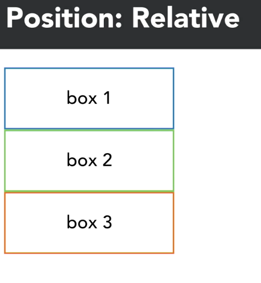
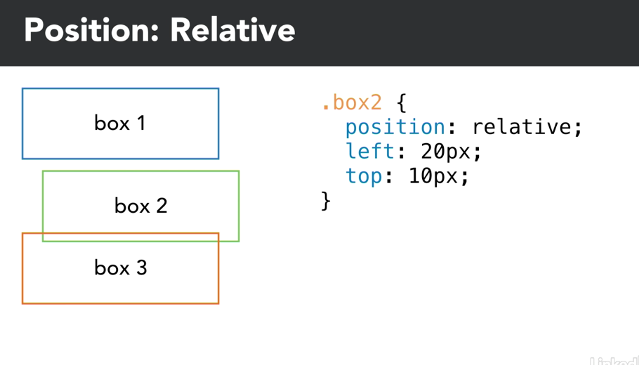
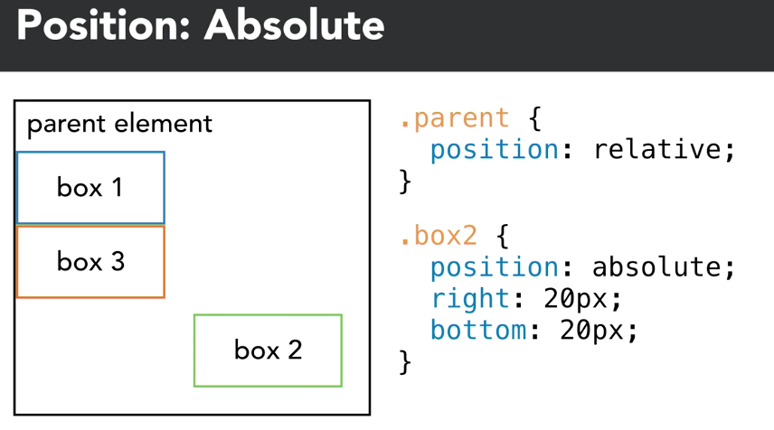
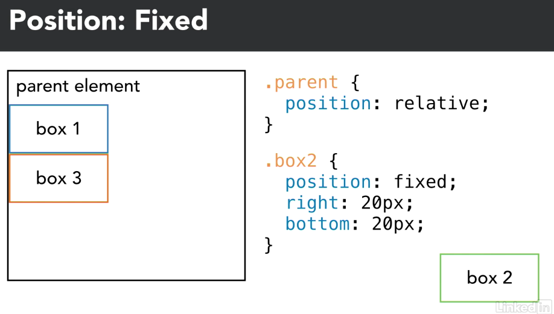

# CSS POSITION CHEAT SHEET
## Position: Relative

Relative to it's position in the regular flow of the page. 

_In this exampe, box 2 would normally stack in between box 1 and box 3. BUT with position: relative, we can use css to move the box from the left 20px and from the top 10px_ 
	

## Position: Absolute

Positioned within its parent or ancestor element. Parent element MUST have `postiion: relative` for this to work. Absolute element is no longer relative to other elements. It's it's own thing. 

## Position: Fixed
Similar to `absolute` but not affected/contained by parent or ancestor. It is always positioned to browser viewport and ignores scrolling

